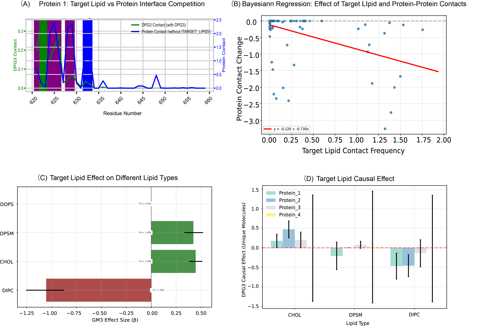

# Summary

LIPAC (Lipid-Protein Analysis with Causal inference) is a Python package for comprehensive analysis of lipid-protein interactions from molecular dynamics simulations. The package uniquely combines traditional contact analysis with Bayesian causal inference to determine how specific lipids, such as ganglioside GM3, causally affect the binding of other membrane lipids to transmembrane proteins. LIPAC implements a within-system causal design that controls for temporal confounders and system heterogeneity, moving beyond correlation to establish directional effects in competitive lipid binding. The package provides both residue-level contact analysis and unique molecule counting, enabling researchers to distinguish between changes in binding affinity and changes in lipid recruitment.

# Statement of need

Understanding lipid-protein interactions is crucial for elucidating membrane protein function, drug-membrane interactions, and the role of lipid rafts in cellular signaling [@Corradi2019]. While molecular dynamics (MD) simulations provide detailed trajectories of these interactions, existing analysis tools primarily focus on descriptive statistics and correlation analysis [@Corradi2018; @Duncan2020]. However, correlation does not imply causation, and the field lacks tools to determine causal relationships in lipid competition and cooperation around membrane proteins.

Current tools such as MDAnalysis [@Michaud2011], GROMACS analysis utilities [@Abraham2015], and FATSLiM [@Buchoux2017] provide excellent frameworks for trajectory analysis and membrane characterization but do not address causal questions such as: "Does GM3 binding causally displace DIPC from the protein surface?" or "Is the observed lipid reorganization a direct effect of GM3 binding or merely a temporal coincidence?" These causal questions are particularly important for understanding ganglioside-mediated regulation of receptor tyrosine kinases [@Coskun2011] and designing lipid-based therapeutic strategies.

LIPAC addresses this gap by implementing a rigorous causal inference framework specifically designed for MD trajectories. The package is particularly valuable for:

1. **Mechanistic studies**: Determining whether specific lipids compete or cooperate for protein binding sites
2. **Drug development**: Understanding how drug-lipid conjugates affect membrane protein environments
3. **Systems biology**: Quantifying lipid-mediated protein regulation in complex membranes
4. **Method development**: Providing a template for causal analysis in molecular simulations

# Mathematics and Implementation

## Causal Model

LIPAC implements a within-system causal design where the treatment (e.g., GM3 binding) and control (GM3 unbound) states occur within the same trajectory. For each lipid type $L$ and protein $P$, the causal effect is modeled as:

$$\text{Contacts}_{L,P,t} \sim \mathcal{N}(\mu_{L,P,t}, \sigma^2)$$

$$\mu_{L,P,t} = \alpha_{L,P} + \beta_{L,P} \cdot \text{GM3}_{P,t}$$

where $\text{GM3}_{P,t}$ is a binary indicator of GM3 binding at time $t$, and $\beta_{L,P}$ represents the causal effect.

## Optimization Strategy

The package employs an XY-plane filtering approach for efficient contact detection in membrane systems:

$$d_{XY} = \sqrt{(x_{\text{lipid}} - x_{\text{protein}})^2 + (y_{\text{lipid}} - y_{\text{protein}})^2}$$

Only lipids with $d_{XY} < 10$ Å undergo detailed atom-by-atom distance calculations, reducing computational complexity from $O(N^2)$ to effectively $O(N)$ for typical membrane protein systems.

# Key Features

- **Dual metric analysis**: Simultaneous calculation of residue-level contacts and unique molecule counts
- **Bayesian causal inference**: Estimation of causal effects with uncertainty quantification using PyMC
- **Parallel processing**: Multi-core trajectory analysis with checkpoint/restart capability
- **Memory efficient**: Optimized for large trajectories through frame batching and spatial filtering
- **Extensive visualization**: Publication-ready plots for contact maps, competition analysis, and causal effects
- **Flexible input**: Supports GROMACS, CHARMM, and AMBER trajectory formats via MDAnalysis

# Example Usage

```python
from lipac import ContactAnalysis, CausalAnalysis

# Stage 1: Contact analysis
analyzer = ContactAnalysis(
    topology='system.psf',
    trajectory='traj.xtc',
    target_lipid='GM3'
)
contacts = analyzer.run(start=0, stop=100000, step=50)

# Stage 2: Causal analysis
causal = CausalAnalysis(contacts)
effects = causal.compute_causal_effects(
    n_samples=2000,
    n_chains=4
)

# Visualize results
causal.plot_effects(output_dir='results/')
```

# Results

Figure 1 demonstrates LIPAC's analytical capabilities using a demonstration dataset from a membrane protein system. The package successfully identifies spatial competition between target lipid binding and protein-protein interactions (A), quantifies the negative correlation between target lipid contact frequency and protein-protein contact changes through Bayesian regression (B), determines target lipid effects on different membrane lipid types with DIPC showing the strongest displacement effect (C), and estimates causal effects across multiple proteins with quantified uncertainty (D).



# Performance

LIPAC has been benchmarked on systems ranging from single transmembrane helices to large protein complexes (>100,000 atoms). On a standard workstation (8 cores, 32 GB RAM), the package processes:
- ~1000 frames/minute for contact analysis
- ~100 frames/minute for causal inference
- Linear scaling with number of proteins and lipid types

# Acknowledgements

We acknowledge contributions and support from Kyoto Pharmaceutical University Fund for the Promotion of Collaborative Research. This work was partially supported by JSPS KAKENHI Grant Number 21K06038.

# References